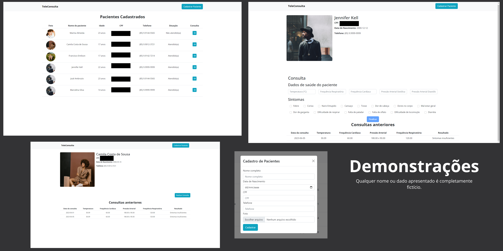

# teleconsulta
 Sistema desafio de gerenciamento médico para consultas de pacientes suspeitos de COVID-19. Desenvolvido utilizando uma abordagem FullStack, combina as poderosas tecnologias Laravel, React, React Bootstrap, Axios e TypeScript.

# 🌇 Apresentação

# 🌠 Badges 
  

# ◽️Índice
* Apresentação
* Badges
* Descrição do Projeto
* Status do Projeto
* Funcionalidades
* Demonstrações

# Descrição do Projeto
Esse é um projeto que visa garantir a ajuda necessária a pessoas especializadas na área da saúde, com foco no atendimento de pacientes que, muitas vezes, ainda possui um método antigo. Torna-se viável, portanto, uma atualização desse processo para garantir a melhor qualidade de atendimentos e, não obstante, da organização de quem atende.

# Status do Projeto
:heavy_check_mark: Projeto concluído :heavy_check_mark: 

Contudo, claro, sempre estará aberto para opiniões e atualizações construtivas

# :hammer: Funcionalidades 
- `Funcionalidade 1`: Cadastro de pacientes
- `Funcionalidade 2`: Cadastro de consultas
- `Funcionalidade 3`: Busca visual de todos os pacientes registrados 
- `Funcionalidade 4`: Busca visua de todas as consultas de cada paciente que já possua ao menos uma registrada
- `Funcionalidade 5`: Busca de dados do paciente para amostra ao usuário

# 🌻 Demontrações

# ♦️ Tecnologias
- <a href="https://axios-http.com/docs/intro">Axios</a>
- <a href="https://legacy.reactjs.org/docs/getting-started.html">React</a>
- <a href="https://react-bootstrap-v4.netlify.app/getting-started/introduction/">React Bootstrap</a>
- <a href="https://www.typescriptlang.org/docs/">TypeScript</a>
- <a href="https://laravel.com/docs/10.x/readme">Laravel 10</a>

# ✈️ Dependências
Antes de tudo, devemos apresentar as dependências que o projeto exije
* Front-End
    * @testing-library/jest-dom (v5.16.5)
    * @testing-library/react (v13.4.0)
    * @testing-library/user-event (v13.5.0)
    * @types/jest (v29.5.1)
    * @types/node (v20.2.0)
    * @types/react-dom (v18.2.4)
    * axios (v1.4.0)
    * react-input-mask (v2.0.4)
    * react (18.2.0)
    * react-bootstrap (v2.7.4)
    * react-dom (v18.2.0)
    * react-icons (v4.8.0)
    * react-router-dom (v6.11.2)
    * react-scripts (v5.0.1)
    * typescript (v5.0.4)
    * web-vitals (v2.1.4)
* Back-End
    * php (v8.1)
    * geekcom/validator-docs (v3.9)

# 🌲 Instalação
Vamos passo a passo. Primeiro, instalaremos o projeto. 
Para isso, é importante que você já tenha o Composer instalado em sua máquina e npm também. Além, é claro, do git.

1. Faça um fork desse repositório para o seu perfil
`git clone https://github.com/emilsonfilho/teleconsulta.git`
2. Acesse o repositório do projeto
`cd teleconsulta`
3. Instale as dependências do back-end
`composer install`
4. Aguarde até que a instalação das dependências seja concluída.
5. Copie e cole o arquivo `.env.example` com um novo nome: `.env`
6. Atualize as variáveis do arquivo de configuração. Caso você ainda não tenha um banco de dados criado, crie-o antes de editar o arquivo `.env`.
7. Gere uma chave para que o Laravel consiga se comunicar com o banco
`php artisan key:generate`
8. "Semeie" o seu banco de dados com registros padrões do sistema, como Sintomas e Resultados
`php artisan db:seed`
9. Acesse o diretório `client`, onde está a parte do front-end com React
`cd client/`
10. Instale as dependências do front-end
`npm install`
11. Se der algum erro, adicione `--force` ao final do comando.
12. Após isso, seu computador estará apto a trabalhar com o projeto em questão. 

# 🎯 Conclusão
O código pode possuir implementações e melhorias ainda, como o registro de diferentes usuários num mesmo sistema, garantindo mais proteção ao projeto. 
O sistema pode implementar a remoção e edição de pacientes.

Feito com ❤️ by <a href="https://github.com/emilsonfilho">EmilsonFilho</a>
